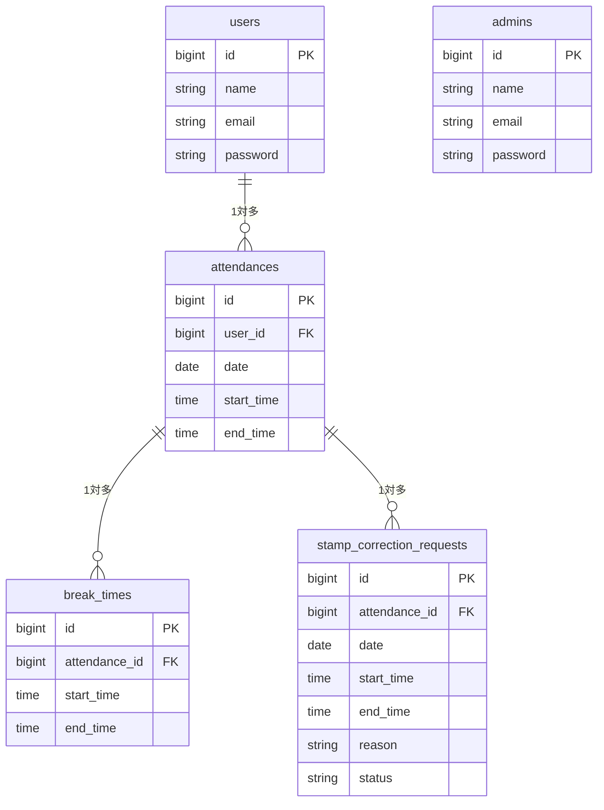

# coachtech 勤怠管理アプリ

ある企業が開発した独自の勤怠管理アプリケーションです。

## 作成目的
ユーザーの勤怠と管理を目的とする

## 機能一覧
- [一般] 会員登録、ログイン、ログアウト
- [一般] 勤怠打刻（出勤、退勤、休憩入、休憩戻）
- [一般] 勤怠一覧表示、詳細表示、修正申請
- [管理者] ログイン、ログアウト
- [管理者] 全ユーザーの日別・月別勤怠一覧表示、詳細表示
- [管理者] 勤怠情報の直接修正
- [管理者] 修正申請の承認
- [管理者] スタッフ一覧表示
- [管理者] 勤怠情報のCSV出力

## 使用技術
- PHP
- Laravel
- MySQL
- Docker

## テーブル設計



## 🛠 環境構築

※ 事前に Docker Desktop を起動しておいてください。

### 1. リポジトリの取得
まずはこのプロジェクトをご自身のパソコンにクローン（コピー）してください。

\`\`\`bash
git clone https://github.com/megumi2233/attendance-app.git
cd attendance-app
\`\`\`

### 2. アプリケーションの起動（魔法のコマンド✨）
プロジェクトのフォルダに移動したら、以下のコマンドを**1回実行するだけ**で、環境構築（コンテナの起動からダミーデータの投入まで）がすべて完了します！

\`\`\`bash
make init
\`\`\`

---

## テスト用ログイン情報

採点・動作確認の際は、以下のテスト用アカウントをご利用ください。

**【管理者ユーザー】**
- メールアドレス: `admin@example.com`
- パスワード: `password`

**【一般ユーザー】**
- メールアドレス: `test@example.com`
- パスワード: `password`

---

## 🚀 動作確認・テスト

アプリケーションが要件を満たし、正常に動作することを「手動」と「自動テスト」の両面から確認済みです。

### ✅ 手動による動作確認
環境構築完了後、以下の手順でスムーズに動作確認を行っていただけます。

- **【メール認証機能の動作確認について】**
新規会員登録直後は自動的にログイン状態となり、仕様上、メール認証誘導画面にはログアウトボタンが配置されておりません（画面設計準拠のため）。
そのため、「メール認証未完了状態でログインを試みる」という要件（メール認証誘導画面への遷移）を確認される際は、**シークレットウィンドウ（プライベートブラウザ）** をご使用いただくか、ブラウザのCookieを削除してテストを行ってください。

---

### 🤖 PHPUnitによる自動テストの実行
自動テスト（Featureテスト）を実行する際は、開発用データベースのデータ消失を防ぐため、**テスト専用のデータベース（`test_database`）**を使用する設定になっています。

テストを実行する前に、以下の手順でテスト環境を構築してください。

#### 1. テスト用環境変数の作成
プロジェクトのルートディレクトリにある `.env.example` をコピーし、`.env.testing` という名前で保存してください。その後、ファイル内のデータベース設定を以下のように変更します。
```env
DB_DATABASE=test_database
```

#### 2. テスト用データベースの作成とマイグレーション
ターミナルで以下のコマンドを順に実行し、テスト専用の空のデータベースを作成後、テーブルを構築します。

Bash
# MySQLコンテナに入り、rootユーザーでログイン（パスワード: root）
```
docker-compose exec mysql bash
mysql -u root -p
```

# テスト用データベースを作成し、コンテナから抜ける
```
CREATE DATABASE test_database;
exit
exit
```

# テスト用DBにマイグレーションを実行する
```
docker-compose exec php php artisan migrate --env=testing
```

#### 3. テストの実行
環境構築後、以下のコマンドで自動テストを実行できます。

Bash
```
docker-compose exec php php artisan test
```

---

### 🧩 View ファイルの作成
resources/views/layouts/app.blade.php   (一般・管理者：全画面共通のヘッダー＆土台)
resources/views/auth/register.blade.php (一般：会員登録画面)
resources/views/auth/login.blade.php    (一般：ログイン画面)
resources/views/attendance/index.blade.php  (一般：勤怠登録画面)
resources/views/attendance/list.blade.php   (一般：勤怠一覧画面)
resources/views/attendance/detail.blade.php (一般：勤怠詳細画面)
resources/views/stamp_correction_request/index.blade.php     (一般：申請一覧画面)
resources/views/auth/verify-email.blade.php   (一般：メール認証誘導画面)
resources/views/admin/auth/login.blade.php  (管理者：ログイン画面)
resources/views/admin/attendance/index.blade.php  (管理者：勤怠一覧)
resources/views/admin/attendance/detail.blade.php (管理者：勤怠詳細)
resources/views/admin/staff/index.blade.php       (管理者：スタッフ一覧) 👈追加！
resources/views/admin/staff/show.blade.php        (管理者：スタッフ別勤怠一覧) 👈追加！
resources/views/admin/stamp_correction_request/index.blade.php　　　(管理者：申請一覧)
resources/views/admin/stamp_correction_request/approve.blade.php　　(管理者：修正申請承認画面)

---

### 🎨 CSS ファイルの作成（✨は使い回しコンポーネント）
public/css/common.css (✨全画面共通のリセット＆ヘッダー用)
public/css/auth.css (✨一般・管理者のログイン・登録画面・メール認証誘導画面用)
public/css/attendance.css (一般：勤怠登録画面)

👇 【最強の使い回しCSS】
public/css/attendance-list.css
  ┣ (一般) 勤怠一覧画面
  ┣ (管理者) 勤怠一覧画面
  ┣ (管理者) スタッフ一覧画面
  ┗ (管理者) スタッフ別勤怠一覧画面

👇 【詳細画面の使い回しCSS】
public/css/attendance-detail.css
  ┣ (一般) 勤怠詳細画面
  ┣ (管理者) 勤怠詳細画面
  ┗ (管理者) 修正申請承認画面 👈追加！

👇 【申請一覧の使い回しCSS】
public/css/request-list.css
  ┣ (一般) 申請一覧画面
  ┗ (管理者) 申請一覧画面 👈追加！

---

### 💡 ダミーデータ確認に関するご注意事項
「勤怠一覧」の画面は、デフォルトで【アクセスした当日の日付】が表示される仕様となっております。
ダミーデータ（Seeder）は「過去1ヶ月間のランダムな日付」で生成されるため、アクセスした当日にデータが存在せず、一覧が空っぽ（ヘッダーのみ）で表示される場合がございます。

その際は、画面内の **「← 前日」ボタン** を数回押して過去の日付に遡っていただくことで、大量のテストデータをご確認いただけます。

---

## 💡 実装のこだわり

本アプリでは、保守性とセキュリティを高めるために以下の工夫を取り入れました。

### 1. URLパスによるヘッダーの自動切り替え
`app.blade.php` 内で `request()->is('admin*')` を使用し、アクセスされているURL（/adminかそれ以外か）に応じて、表示するメニュー「管理者用メニュー」と「一般ユーザー用メニュー」を自動で切り替えるようにしました。
- **工夫した点**: 画面ごとにフラグを渡す手作業をなくすことで、メニューの出し忘れや表示ミスが起きない仕組みにしました。

### 2. Bladeファイルのコンポーネント化（部品化）
共通のヘッダーの中身を `header-admin.blade.php` と `header-user.blade.php` に分離し、`@include` で呼び出す構成にしました。
- **工夫した点**: ヘッダーのデザインや項目で修正が必要な際に1つのファイルを直すだけで全画面に反映されるため、直しやすく読みやすいコードを実現しました。

### 3. 親玉（AdminBaseController）による一括ガード
管理者用の全コントローラーに共通の親クラス `AdminBaseController` を作成し、一括で `auth:admin` ミドルウェア（門番）を適用しました。
- **工夫した点**: 新しく管理者画面を追加した際、このクラスを継承するだけで自動的にセキュリティが確保されます。`web.php` や各メソッドに何度も同じガードを書く必要がなく、安全でスッキリとした構造になっています。　

---
