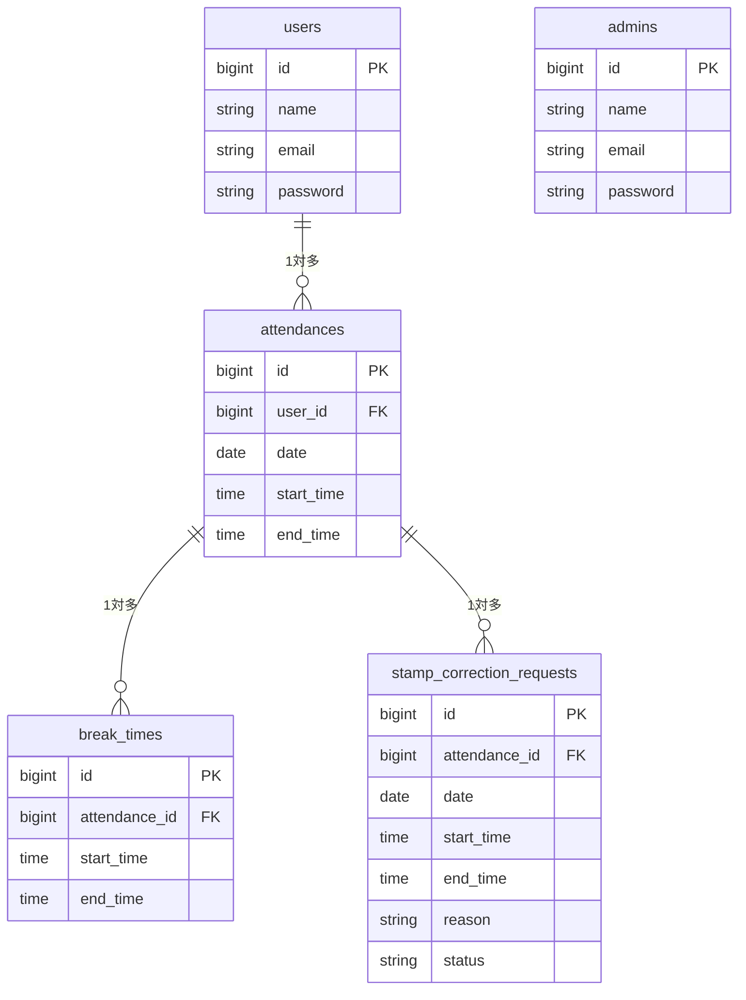

# coachtech 勤怠管理アプリ

ある企業が開発した独自の勤怠管理アプリケーションです。

## 作成目的
ユーザーの勤怠と管理を目的とする

## 機能一覧
- [一般] 会員登録、ログイン、ログアウト
- [一般] 勤怠打刻（出勤、退勤、休憩入、休憩戻）
- [一般] 勤怠一覧表示、詳細表示、修正申請
- [管理者] ログイン、ログアウト
- [管理者] 全ユーザーの日別・月別勤怠一覧表示、詳細表示
- [管理者] 勤怠情報の直接修正
- [管理者] 修正申請の承認
- [管理者] スタッフ一覧表示
- [管理者] 勤怠情報のCSV出力

## 使用技術
- PHP
- Laravel
- MySQL
- Docker

## テーブル設計

## 🛠 環境構築

※ 事前に Docker Desktop を起動しておいてください。

### 1. リポジトリの取得
まずはこのプロジェクトをご自身のパソコンにクローン（コピー）してください。

\`\`\`bash
git clone https://github.com/megumi2233/attendance-app.git
cd attendance-app
\`\`\`

### 2. アプリケーションの起動（魔法のコマンド✨）
プロジェクトのフォルダに移動したら、以下のコマンドを**1回実行するだけ**で、環境構築（コンテナの起動からダミーデータの投入まで）がすべて完了します！

\`\`\`bash
make init
\`\`\`

---

## テスト用ログイン情報

採点・動作確認の際は、以下のテスト用アカウントをご利用ください。

**【管理者ユーザー】**
- メールアドレス: `admin@example.com`
- パスワード: `password`

**【一般ユーザー】**
- メールアドレス: `test@example.com`
- パスワード: `password`

---

### 🧩 View ファイルの作成
resources/views/layouts/app.blade.php （一般：全画面共通のヘッダー＆土台）
resources/views/auth/register.blade.php （一般：会員登録画面）
resources/views/auth/login.blade.php （一般：ログイン画面）
resources/views/attendance/index.blade.php （一般：勤怠登録画面）
resources/views/attendance/list.blade.php （一般：勤怠一覧画面）
resources/views/attendance/detail.blade.php （一般：勤怠詳細画面）

---

### 🎨 CSS ファイルの作成
public/css/common.css （一般：全画面共通のリセット＆ヘッダー用）
public/css/auth.css （一般：会員登録・ログイン画面）
public/css/attendance.css （一般：勤怠登録画面）
public/css/attendance-list.css （一般：勤怠一覧画面）
public/css/attendance-detail.css （一般：勤怠詳細画面）

---
