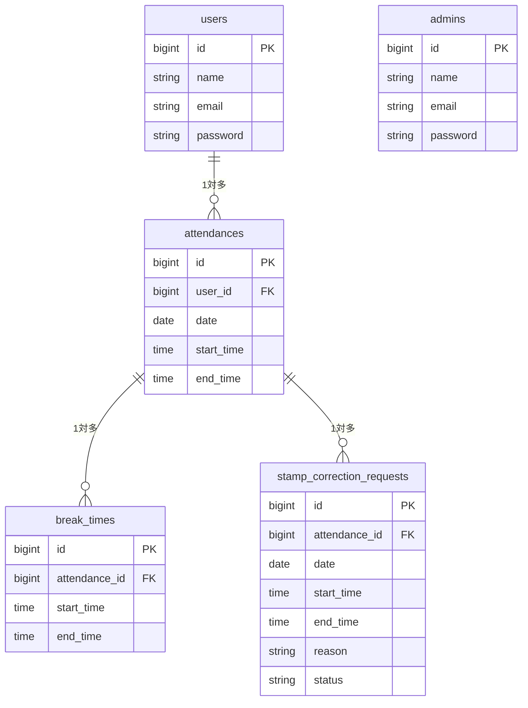

# coachtech 勤怠管理アプリ

### 概要
COACHTECH 模擬案件：ある企業が開発した独自の勤怠管理アプリケーションです。

従業員の勤怠打刻（出勤・退勤・休憩）や、管理者による勤怠状況の確認・修正申請の承認機能などを実装しています。

---

### 💻 使用技術
- **PHP 8.x**
- **Laravel 8.x**
- **MySQL 8.0**
- **Docker（開発環境構築）**
  - nginx / php / mysql / mailhog
- **Laravel Fortify**（認証機能の実装：一般ユーザー・管理者のマルチ認証対応）
- **Carbon**（日付・時刻操作ライブラリ：打刻管理・月次集計に使用）
- **テスト**: PHPUnit（機能テスト・バリデーションテスト）
- **フロントエンド**: CSS (独自デザイン / レスポンシブ対応)
- **その他**: 
  - CSV出力機能（スタッフ毎の月次勤怠データ出力）
  - MailHog（ローカル環境でのメール認証テスト用）

---

## 🛠 環境構築

※ 事前に Docker Desktop を起動しておいてください。

### 1. リポジトリの取得
まずはこのプロジェクトをご自身のパソコンにクローン（コピー）してください。

\`\`\`bash
git clone https://github.com/megumi2233/attendance-app.git
cd attendance-app
\`\`\`

### 2. アプリケーションの起動（魔法のコマンド✨）
プロジェクトのフォルダに移動したら、以下のコマンドを**1回実行するだけ**で、環境構築（コンテナの起動からダミーデータの投入まで）がすべて完了します！

\`\`\`bash
make init
\`\`\`

---

## 🚀 動作確認・テスト

アプリケーションが要件を満たし、正常に動作することを「手動」と「自動テスト」の両面から確認済みです。

### ✅ 手動による動作確認
環境構築完了後、以下の手順で実際のユーザーフローに沿って動作確認を行っていただけます。

- **効率的な動作確認の方法（おすすめ）**:
  一般ユーザー画面と管理者画面の「動線」を同時に確認する場合、ログイン情報の重複を避けるため、別々のブラウザ（例：Google ChromeとMicrosoft Edgeなど）をシークレットモードで開き、それぞれ別のアカウントでログインして確認することをお勧めします。

#### 1. テスト用ログイン情報（シーディング済み）
スムーズに動作確認・採点を行っていただくため、初期データとして以下のテストアカウントを用意しています。（ご自身で新規登録からテストしていただくことも可能です）

**【管理者ユーザー】**
- ログインURL: [http://localhost/admin/login](http://localhost/admin/login)
- メールアドレス: `admin@example.com`
- パスワード: `password`

**【一般ユーザー】**
- ログインURL: [http://localhost/login](http://localhost/login)
- メールアドレス: `test@example.com`
- パスワード: `password`

#### 2. 新規ユーザー登録とメール認証フロー（※新規作成から試す場合）
- **新規会員登録画面**: [http://localhost/register](http://localhost/register)
- **メール認証の完了手順**:
  1. 会員登録後、「メール認証誘導画面」が表示されます。
  2. 画面中央の **「認証はこちらから」** ボタンをクリックすると、MailHog（[http://localhost:8025/](http://localhost:8025/)）が開きます。
  3. 届いた確認メールを開き、本文内の **「Verify Email Address」** ボタンをクリックして認証を完了させてください。
  ※万が一メールが届かない場合は、画面下の「認証メールを再送する」から再送処理が可能です。
- **メール認証機能の動作確認について（注意点）**:
  新規会員登録直後は自動的にログイン状態となり、仕様上、メール認証誘導画面にはログアウトボタンが配置されておりません。
  そのため、「メール認証未完了状態でログインを試みる」という要件を確認される際は、**シークレットウィンドウ**をご使用いただくか、ブラウザのCookieを削除してテストを行ってください。

#### 3. 勤怠打刻と申請（一般ユーザー機能）
- **勤怠打刻画面**: 出勤・退勤・休憩開始・休憩戻の各ボタンによる打刻操作が可能です。
- **勤怠一覧・詳細**: 「勤怠一覧」から各日の「詳細」画面へ遷移し、打刻漏れなどの修正申請を管理者へ送信できます。

#### 4. 管理者による承認・管理フロー
- **管理者画面**: 管理者アカウントでログインし、全スタッフの勤怠状況やスタッフ別の一覧を確認できます。
- **勤怠の直接修正**: スタッフの勤怠詳細画面から、管理者権限で直接打刻データの修正を行えます。
- **申請承認**: 一般ユーザーから届いた修正申請の一覧を確認し、「承認」操作を行えます。
- **CSV出力**: スタッフごとの月次勤怠データをCSV形式でダウンロード可能です。

#### 5. データベースの確認
開発環境では phpMyAdmin を利用して、ブラウザからデータベースの内容を直接確認いただけます。
- **phpMyAdmin**: [http://localhost:8080/](http://localhost:8080/)
  - ユーザー名: `laravel_user`
  - パスワード: `laravel_pass`
  → 以下の主要テーブルへのデータ反映状況を即座に確認可能です。
    - `users` / `admins`（ユーザー情報）
    - `attendances` / `break_times`（勤務・休憩記録）
    - `stamp_correction_requests` / `stamp_correction_request_break_times`（修正申請データ）

### 🤖 PHPUnitによる自動テストの実行

アプリケーションの品質を担保するため、設計書のテストケース一覧に基づき、主要機能（ユーザー登録、ログイン、勤怠打刻、一覧取得、修正申請など）に対してフィーチャーテストを実装・実行済みです。

#### 1. テストの網羅範囲
- **機能要件**: 認証機能、日時取得、ステータス確認、出勤・退勤・休憩機能、勤怠一覧・詳細情報取得、修正機能、スタッフ一覧・月次勤怠取得など、仕様書に記載された全機能の正常動作を網羅。
- **バリデーション**: 各フォーム（登録、ログイン、打刻、修正申請など）における必須入力チェックや、時間的な矛盾（例：出勤時間が退勤時間より後になっている場合）などの異常系動作についても検証済みです。

#### 2. テスト用環境の構築
自動テスト（Featureテスト）を実行する際は、開発用データベースのデータ消失を防ぐため、**テスト専用のデータベース（`test_database`）** を使用する設定になっています。
テストを実行する前に、以下の手順でテスト環境を構築してください。

**①テスト用環境変数の作成**
プロジェクトのルートディレクトリにある `.env.example` をコピーし、`.env.testing` という名前で保存してください。その後、ファイル内のデータベース設定を以下のように変更します。
```env
DB_DATABASE=test_database
```

**②テスト用データベースの作成とマイグレーション
ターミナルで以下のコマンドを順に実行し、テスト専用の空のデータベースを作成後、テーブルを構築します。

Bash
# MySQLコンテナに入り、rootユーザーでログイン（パスワード: root）
```
docker-compose exec mysql bash
mysql -u root -p
```

# テスト用データベースを作成し、コンテナから抜ける
```
CREATE DATABASE test_database;
exit
exit
```

# テスト用DBにマイグレーションを実行する
```
docker-compose exec php php artisan migrate --env=testing
```

#### 3. テストの実行
環境構築後、以下のコマンドで自動テストを実行できます。

Bash
```
docker-compose exec php php artisan test
```
※ 実装したすべてのテストケースにおいて、正常にパスすることを確認済みです。

---

### 💡 補足：テスト実行後のデータについて
PHPUnit（自動テスト）を実行すると、データベースの状態がリセットされるため、手動確認用のテストユーザーが消えてしまうことがあります。
もしログインできなくなった場合は、以下のコマンドを再度実行してデータを投入してください。

bash
```
docker-compose exec php php artisan db:seed
```

---


## 機能一覧
- [一般] 会員登録、ログイン、ログアウト
- [一般] 勤怠打刻（出勤、退勤、休憩入、休憩戻）
- [一般] 勤怠一覧表示、詳細表示、修正申請
- [管理者] ログイン、ログアウト
- [管理者] 全ユーザーの日別・月別勤怠一覧表示、詳細表示
- [管理者] 勤怠情報の直接修正
- [管理者] 修正申請の承認
- [管理者] スタッフ一覧表示
- [管理者] 勤怠情報のCSV出力

## テーブル設計




## テスト用ログイン情報

採点・動作確認の際は、以下のテスト用アカウントをご利用ください。

**【管理者ユーザー】**
- メールアドレス: `admin@example.com`
- パスワード: `password`

**【一般ユーザー】**
- メールアドレス: `test@example.com`
- パスワード: `password`

---

## 🚀 動作確認・テスト

アプリケーションが要件を満たし、正常に動作することを「手動」と「自動テスト」の両面から確認済みです。

### ✅ 手動による動作確認
環境構築完了後、以下の手順でスムーズに動作確認を行っていただけます。

- **【メール認証機能の動作確認について】**
新規会員登録直後は自動的にログイン状態となり、仕様上、メール認証誘導画面にはログアウトボタンが配置されておりません（画面設計準拠のため）。
そのため、「メール認証未完了状態でログインを試みる」という要件（メール認証誘導画面への遷移）を確認される際は、**シークレットウィンドウ（プライベートブラウザ）** をご使用いただくか、ブラウザのCookieを削除してテストを行ってください。

---

### 🤖 PHPUnitによる自動テストの実行
自動テスト（Featureテスト）を実行する際は、開発用データベースのデータ消失を防ぐため、**テスト専用のデータベース（`test_database`）**を使用する設定になっています。

テストを実行する前に、以下の手順でテスト環境を構築してください。

#### 1. テスト用環境変数の作成
プロジェクトのルートディレクトリにある `.env.example` をコピーし、`.env.testing` という名前で保存してください。その後、ファイル内のデータベース設定を以下のように変更します。
```env
DB_DATABASE=test_database
```

#### 2. テスト用データベースの作成とマイグレーション
ターミナルで以下のコマンドを順に実行し、テスト専用の空のデータベースを作成後、テーブルを構築します。

Bash
# MySQLコンテナに入り、rootユーザーでログイン（パスワード: root）
```
docker-compose exec mysql bash
mysql -u root -p
```

# テスト用データベースを作成し、コンテナから抜ける
```
CREATE DATABASE test_database;
exit
exit
```

# テスト用DBにマイグレーションを実行する
```
docker-compose exec php php artisan migrate --env=testing
```

#### 3. テストの実行
環境構築後、以下のコマンドで自動テストを実行できます。

Bash
```
docker-compose exec php php artisan test
```

---

### 💡 補足：テスト実行後のデータについて
PHPUnit（自動テスト）を実行すると、データベースの状態がリセットされるため、手動確認用のテストユーザーが消えてしまうことがあります。
もしログインできなくなった場合は、以下のコマンドを再度実行してデータを投入してください。

bash
docker-compose exec php php artisan db:seed

---

### 🧩 View ファイルの作成
resources/views/layouts/app.blade.php   (一般・管理者：全画面共通のヘッダー＆土台)
resources/views/auth/register.blade.php (一般：会員登録画面)
resources/views/auth/login.blade.php    (一般：ログイン画面)
resources/views/attendance/index.blade.php  (一般：勤怠登録画面)
resources/views/attendance/list.blade.php   (一般：勤怠一覧画面)
resources/views/attendance/detail.blade.php (一般：勤怠詳細画面)
resources/views/stamp_correction_request/index.blade.php     (一般：申請一覧画面)
resources/views/auth/verify-email.blade.php   (一般：メール認証誘導画面)
resources/views/admin/auth/login.blade.php  (管理者：ログイン画面)
resources/views/admin/attendance/index.blade.php  (管理者：勤怠一覧)
resources/views/admin/attendance/detail.blade.php (管理者：勤怠詳細)
resources/views/admin/staff/index.blade.php       (管理者：スタッフ一覧) 👈追加！
resources/views/admin/staff/show.blade.php        (管理者：スタッフ別勤怠一覧) 👈追加！
resources/views/admin/stamp_correction_request/index.blade.php　　　(管理者：申請一覧)
resources/views/admin/stamp_correction_request/approve.blade.php　　(管理者：修正申請承認画面)

---

### 🎨 CSS ファイルの作成（✨は使い回しコンポーネント）
public/css/common.css (✨全画面共通のリセット＆ヘッダー用)
public/css/auth.css (✨一般・管理者のログイン・登録画面・メール認証誘導画面用)
public/css/attendance.css (一般：勤怠登録画面)

👇 【最強の使い回しCSS】
public/css/attendance-list.css
  ┣ (一般) 勤怠一覧画面
  ┣ (管理者) 勤怠一覧画面
  ┣ (管理者) スタッフ一覧画面
  ┗ (管理者) スタッフ別勤怠一覧画面

👇 【詳細画面の使い回しCSS】
public/css/attendance-detail.css
  ┣ (一般) 勤怠詳細画面
  ┣ (管理者) 勤怠詳細画面
  ┗ (管理者) 修正申請承認画面 👈追加！

👇 【申請一覧の使い回しCSS】
public/css/request-list.css
  ┣ (一般) 申請一覧画面
  ┗ (管理者) 申請一覧画面 👈追加！

---

### 💡 ダミーデータ確認に関するご注意事項
「勤怠一覧」の画面は、デフォルトで【アクセスした当日の日付】が表示される仕様となっております。
ダミーデータ（Seeder）は「過去1ヶ月間のランダムな日付」で生成されるため、アクセスした当日にデータが存在せず、一覧が空っぽ（ヘッダーのみ）で表示される場合がございます。

その際は、画面内の **「← 前日」ボタン** を数回押して過去の日付に遡っていただくことで、大量のテストデータをご確認いただけます。

---

## 💡 実装のこだわり

本アプリでは、保守性とセキュリティを高めるために以下の工夫を取り入れました。

### 1. URLパスによるヘッダーの自動切り替え
`app.blade.php` 内で `request()->is('admin*')` を使用し、アクセスされているURL（/adminかそれ以外か）に応じて、表示するメニュー「管理者用メニュー」と「一般ユーザー用メニュー」を自動で切り替えるようにしました。
- **工夫した点**: 画面ごとにフラグを渡す手作業をなくすことで、メニューの出し忘れや表示ミスが起きない仕組みにしました。

### 2. Bladeファイルのコンポーネント化（部品化）
共通のヘッダーの中身を `header-admin.blade.php` と `header-user.blade.php` に分離し、`@include` で呼び出す構成にしました。
- **工夫した点**: ヘッダーのデザインや項目で修正が必要な際に1つのファイルを直すだけで全画面に反映されるため、直しやすく読みやすいコードを実現しました。

### 3. 親玉（AdminBaseController）による一括ガード
管理者用の全コントローラーに共通の親クラス `AdminBaseController` を作成し、一括で `auth:admin` ミドルウェア（門番）を適用しました。
- **工夫した点**: 新しく管理者画面を追加した際、このクラスを継承するだけで自動的にセキュリティが確保されます。`web.php` や各メソッドに何度も同じガードを書く必要がなく、安全でスッキリとした構造になっています。　

---

### 4. 実際の業務を想定した「柔軟かつ厳密な」時間バリデーション
Laravel標準の `after` や `before` ルールでは、「15:13」といった時間（H:i）のみの比較時に意図せぬ挙動が生じる課題がありました。これを解決するため、入力値を「分」に換算して比較する独自のカスタムバリデーションを実装しました。
- **工夫した点**: 現場での実際の利用シーンを想定し、以下のイレギュラーな打刻に完璧に対応しつつ、不整合なデータは防ぐバランスの良い設計を実現しました。
  - **0分休憩の許容（開始・終了が同刻）**: 誤タップによる即時復帰を想定し、「優しさ」を持たせました。
  - **退勤と同時の休憩終了**: 業務終了と同時に休憩を終えるケースを許容する「柔軟さ」を取り入れました。
  - **休憩時間の重複防止**: 前の休憩が終了する前に次の休憩が開始される「時間の矛盾（かぶり）」を完全にブロックする「正確さ」を重視しました。

### 5. ユーザーをパニックにさせない「優しいエラー表示（UX）」
エラー発生時にユーザーがストレスを感じないよう、画面側の実装にも工夫を凝らしました。
- **工夫した点**: 以下の手法を取り入れ、直感的に修正しやすい画面を構築しました。
  - **`old()`関数の徹底**: エラー時に「修正前の値」に勝手にリセットされるのを防ぎ、ユーザーが「間違えて入力した値」をそのまま残すことで、どこを直すべきか明確にしました。
  - **`bail`ルールの適用**: 1つの項目で複数のルールに引っかかった場合でも、エラーが複数行に渡って画面を圧迫しないよう、最初の1つだけを表示してストップさせています。
  - **メッセージの単一化**: Blade側でも `@if ~ @elseif` を用い、入力枠に対して赤字のエラーが1つだけピンポイントで出るように制御しました。

### 6. 同じことを2回書かない「DRY原則」に基づいたコード設計
管理者画面と一般ユーザー画面で「勤怠の修正」という同じロジックを扱うため、コードの共通化を行いました。
- **工夫した点**: 以下の共通化により、バグの発生を防ぎ保守性の高い設計（DRY原則）にしました。
  - **FormRequestの統一**: 管理者用と一般ユーザー用でバリデーションルール（複雑な時間計算）を完全に一致させ、どちらから操作してもシステムに矛盾が生じない堅牢な設計にしました。
  - **共通CSSクラスの作成**: 日付表示のレイアウト調整において、各画面に別々のスタイルを書くのではなく、共通の `wide-date-separator` クラスを作成し、1箇所の修正で両画面のデザインを同時にコントロールできるようにしました。

---
