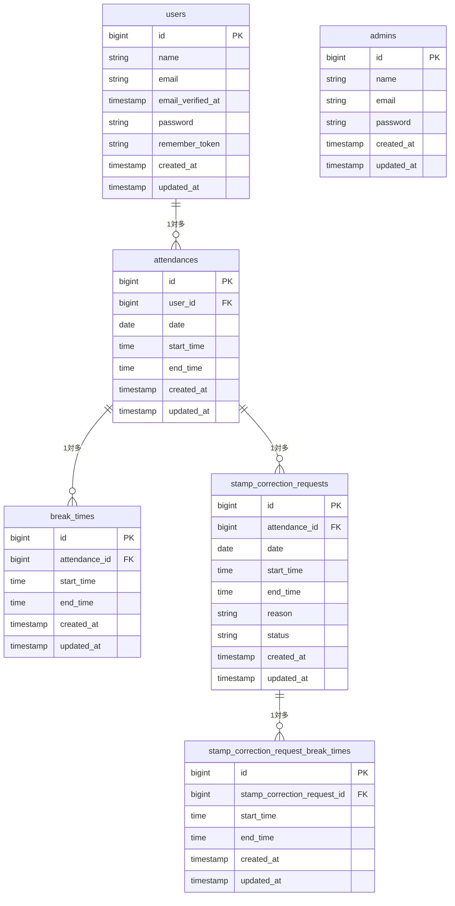

# coachtech 勤怠管理アプリ

COACHTECH 模擬案件として開発した勤怠管理アプリケーションです。  
一般ユーザーの勤怠打刻（出勤・退勤・休憩）から、管理者による勤怠確認・修正承認まで、  
実務を想定したフローを一通り実装しています。

---

### 💻 使用技術
- **PHP 8.x**
- **Laravel 8.x**
- **MySQL 8.0**
- **Docker（開発環境構築）**
  - nginx / php / mysql / mailhog
- **Laravel Fortify**（認証機能の実装：一般ユーザー・管理者のマルチ認証対応）
- **Carbon**（日付・時刻操作ライブラリ：打刻管理・月次集計に使用）
- **テスト**: PHPUnit（機能テスト・バリデーションテスト）
- **フロントエンド**: CSS (独自デザイン / レスポンシブ対応)
- **その他**: 
  - CSV出力機能（スタッフ毎の月次勤怠データ出力）
  - MailHog（ローカル環境でのメール認証テスト用）

---

## 📋 機能一覧
- [一般] 会員登録、ログイン、ログアウト（メール認証機能を含む）
- [一般] 状態連動型 勤怠打刻（出勤・退勤・休憩入・休憩戻）
- [一般] 勤怠一覧表示、詳細表示、修正申請（ステータスによる編集制限あり）
- [管理者] ログイン、ログアウト
- [管理者] 全ユーザーの日別・月別勤怠一覧表示（前後移動機能付き）
- [管理者] 勤怠情報の直接修正、修正申請の承認
- [管理者] スタッフ一覧表示、個別勤怠詳細表示
- [管理者] 勤怠情報のCSV出力（月次データ）

---

## 🛠 環境構築

※ 事前に Docker Desktop を起動しておいてください。

### Prerequisites（前提条件）
このプロジェクトを動かすには、以下のツールがインストールされている必要があります。

- **Docker / Docker Compose**
- **make** (インストールされていない場合は、以下のコマンドを実行してください)
  ```bash
  sudo apt update && sudo apt install -y make
  ```

### 1. リポジトリの取得
まずはこのプロジェクトをご自身のパソコンにクローン（コピー）してください。

```bash
git clone git@github.com:megumi2233/attendance-app.git
```

```bash
cd attendance-app
```

### 2. アプリケーションの起動（魔法のコマンド✨）
プロジェクトのフォルダに移動したら、以下のコマンドを**1回実行するだけ**で、環境構築（コンテナの起動からダミーデータの投入まで）がすべて完了します！

```bash
make init
```
💡 これだけで「開発用」と「テスト用」両方の環境構築が自動で完了します！ 手動での設定ファイル（.env / .env.testing）の作成や、テスト用データベースの構築・権限設定などの作業は一切不要です。

> [!TIP]
> **セットアップ中にエラー（504 Gateway Time-out等）が出た場合**
> ネットワークの混雑により、稀にコンテナのダウンロードが中断されることがあります。その場合は、再度 `make init` を実行してください。中断された箇所から再開され、正常に完了します。

---

## 🚀 動作確認・テスト
アプリケーションが要件を満たし、正常に動作することを「手動」と「自動テスト」の両面から確認済みです。

### ✅ 手動による動作確認
環境構築完了後、以下の手順で実際のユーザーフローに沿って動作確認を行っていただけます。

- **効率的な動作確認の方法（おすすめ）**:
  一般ユーザー画面と管理者画面の「動線」を同時に確認する場合、ログイン情報の重複を避けるため、別々のブラウザ（例：Google ChromeとMicrosoft Edgeなど）をシークレットモードで開き、それぞれ別のアカウントでログインして確認することをお勧めします。

#### 1. テスト用ログイン情報（シーディング済み）
スムーズに動作確認・採点を行っていただくため、初期データとして以下のテストアカウントを用意しています。（ご自身で新規登録からテストしていただくことも可能です）

**【管理者ユーザー】**
- ログインURL: [http://localhost/admin/login](http://localhost/admin/login)
- メールアドレス:
```text
admin@example.com
```

- パスワード:
```text
password
```

**【一般ユーザー】**
- ログインURL: [http://localhost/login](http://localhost/login)
- メールアドレス:
```text
test@example.com
```

- パスワード:
```text
password
```

#### 2. 新規ユーザー登録とメール認証フロー（※新規作成から試す場合）
- **新規会員登録画面**: [http://localhost/register](http://localhost/register)
- **メール認証の完了手順**:
  1. 会員登録後、「メール認証誘導画面」が表示されます。
  2. 画面中央の **「認証はこちらから」** ボタンをクリックすると、MailHog（[http://localhost:8025/](http://localhost:8025/)）が開きます。
  3. 届いた確認メールを開き、本文内の **「Verify Email Address」** ボタンをクリックして認証を完了させてください。
  ※万が一メールが届かない場合は、画面下の「認証メールを再送する」から再送処理が可能です。
- **メール認証機能の動作確認について（注意点）**:
  新規会員登録直後は自動的にログイン状態となり、仕様上、メール認証誘導画面にはログアウトボタンが配置されておりません。
  そのため、「メール認証未完了状態でログインを試みる」という要件を確認される際は、**シークレットウィンドウ**をご使用いただくか、ブラウザのCookieを削除してテストを行ってください。

#### 3. 勤怠打刻と申請（一般ユーザー機能）
- **勤怠打刻画面**: 出勤・退勤・休憩開始・休憩戻の各ボタンによる打刻操作が可能です。
- **勤怠一覧・詳細**: 「勤怠一覧」から各日の「詳細」画面へ遷移し、打刻漏れなどの修正申請を管理者へ送信できます。

#### 4. 管理者による承認・管理フロー
- **管理者画面**: 管理者アカウントでログインし、全スタッフの勤怠状況やスタッフ別の一覧を確認できます。
- **勤怠の直接修正**: スタッフの勤怠詳細画面から、管理者権限で直接打刻データの修正を行えます。
- **申請承認**: 一般ユーザーから届いた修正申請の一覧を確認し、「承認」操作を行えます。
- **CSV出力**: スタッフごとの月次勤怠データをCSV形式でダウンロード可能です。

#### 5. データベースの確認
開発環境では phpMyAdmin を利用して、ブラウザからデータベースの内容を直接確認いただけます。
- **phpMyAdmin**: [http://localhost:8080/](http://localhost:8080/)
  - ユーザー名: `laravel_user`
  - パスワード: `laravel_pass`
  → 以下の主要テーブルへのデータ反映状況を即座に確認可能です。
    - `users` / `admins`（ユーザー情報）
    - `attendances` / `break_times`（勤務・休憩記録）
    - `stamp_correction_requests` / `stamp_correction_request_break_times`（修正申請データ）

### 🤖 PHPUnitによる自動テストの実行

アプリケーションの品質を担保するため、設計書のテストケース一覧に基づき、主要機能（ユーザー登録、ログイン、勤怠打刻、一覧取得、修正申請など）に対してフィーチャーテストを実装・実行済みです。

#### 1. テストの網羅範囲
- **機能テスト**: 認証機能、日時取得、ステータス確認、出勤・退勤・休憩機能、勤怠一覧・詳細情報取得、修正機能、スタッフ一覧・月次勤怠取得など、テストケース一覧に記載された正常動作を網羅。
- **バリデーションテスト**: 各フォームにおける必須入力チェックや、時間的な矛盾（例：出勤時間が退勤時間より後になっている場合）などの異常系動作についても、テストケースに基づき検証済みです。

#### 2. テスト用環境の構築
自動テスト（Featureテスト）を実行する際は、開発用データベースのデータ消失を防ぐため、**テスト専用のデータベース（`test_database`）** を使用する設定になっています。

**💡 テスト環境の準備は全自動です！**
本プロジェクトでは、初回セットアップコマンド（`make init`）の中に、テスト用環境の構築もすべて含まれています。
そのため、`make init` を実行済みであれば、以下の準備が自動的に完了しています。
- テスト用環境変数ファイル（`.env.testing`）の生成と設定
- テスト専用データベースの作成と、マイグレーションの実行

テスト実行前の手動での追加作業は一切不要です。

#### 3. テストの実行
環境構築が完了している状態で、ターミナルから以下のコマンドを実行するだけで自動テストを開始できます。

```bash
docker-compose exec php php artisan test
```
※ 実装したすべてのテストケースにおいて、正常にパスすることを確認済みです。

---

## 🗄️ テーブル設計
※ 各テーブルのリレーションシップについては、後述のER図をご参照ください。

### 1. users テーブル（一般ユーザーの情報）

| カラム名 | 型 | PK | UNIQUE | NOT NULL | FK (外部キー) |
|---|---|:---:|:---:|:---:|---|
| id | unsigned bigint | 〇 | | 〇 | |
| name | string | | | 〇 | |
| email | string | | 〇 | 〇 | |
| email_verified_at | timestamp | | | | |
| password | string | | | 〇 | |
| remember_token | string | | | | |
| created_at | timestamp | | | | |
| updated_at | timestamp | | | | |

### 2. admins テーブル（管理者の情報）

| カラム名 | 型 | PK | UNIQUE | NOT NULL | FK (外部キー) |
|---|---|:---:|:---:|:---:|---|
| id | unsigned bigint | 〇 | | 〇 | |
| name | string | | | 〇 | |
| email | string | | 〇 | 〇 | |
| password | string | | | 〇 | |
| created_at | timestamp | | | | |
| updated_at | timestamp | | | | |

### 3. attendances テーブル（勤怠の情報）

| カラム名 | 型 | PK | UNIQUE | NOT NULL | FK (外部キー) |
|---|---|:---:|:---:|:---:|---|
| id | unsigned bigint | 〇 | | 〇 | |
| user_id | unsigned bigint | | | 〇 | users(id) |
| date | date | | | 〇 | |
| start_time | time | | | 〇 | |
| end_time | time | | | | |
| created_at | timestamp | | | | |
| updated_at | timestamp | | | | |

### 4. break_times テーブル（休憩の情報）

| カラム名 | 型 | PK | UNIQUE | NOT NULL | FK (外部キー) |
|---|---|:---:|:---:|:---:|---|
| id | unsigned bigint | 〇 | | 〇 | |
| attendance_id | unsigned bigint | | | 〇 | attendances(id) |
| start_time | time | | | 〇 | |
| end_time | time | | | | |
| created_at | timestamp | | | | |
| updated_at | timestamp | | | | |

### 5. stamp_correction_requests テーブル（修正申請の情報）

| カラム名 | 型 | PK | UNIQUE | NOT NULL | FK (外部キー) |
|---|---|:---:|:---:|:---:|---|
| id | unsigned bigint | 〇 | | 〇 | |
| attendance_id | unsigned bigint | | | 〇 | attendances(id) |
| date | date | | | 〇 | |
| start_time | time | | | 〇 | |
| end_time | time | | | 〇 | |
| reason | string | | | 〇 | |
| status | string | | | 〇 | |
| created_at | timestamp | | | | |
| updated_at | timestamp | | | | |

### 6. stamp_correction_request_break_times テーブル（修正申請の休憩情報）

| カラム名 | 型 | PK | UNIQUE | NOT NULL | FK (外部キー) |
|---|---|:---:|:---:|:---:|---|
| id | unsigned bigint | 〇 | | 〇 | |
| stamp_correction_request_id | unsigned bigint | | | 〇 | stamp_correction_requests(id) |
| start_time | time | | | | |
| end_time | time | | | | |
| created_at | timestamp | | | | |
| updated_at | timestamp | | | | |

---

### 🗺️ ER図（データ構造）

このアプリケーションのデータ構造を視覚的に把握するため、以下にER図を掲載しています。

この図では、`users`（ユーザー）テーブルと `attendances`（勤怠）テーブルを中心に構成されています。
ユーザーが毎日の勤怠データを記録するという関係性から、`users` と `attendances` は「1対多」のリレーションで接続されています。
また、1日の勤怠に対して複数回の休憩をとったり、修正申請を行ったりできるよう、`attendances` テーブルは `break_times` および `stamp_correction_requests` とそれぞれ「1対多」の関係となっています。

```mermaid
erDiagram
    users ||--o{ attendances : "1対多"
    attendances ||--o{ break_times : "1対多"
    attendances ||--o{ stamp_correction_requests : "1対多"
    stamp_correction_requests ||--o{ stamp_correction_request_break_times : "1対多"

    users {
        bigint id PK
        string name
        string email
        timestamp email_verified_at
        string password
        string remember_token
        timestamp created_at
        timestamp updated_at
    }
    admins {
        bigint id PK
        string name
        string email
        string password
        timestamp created_at
        timestamp updated_at
    }
    attendances {
        bigint id PK
        bigint user_id FK
        date date
        time start_time
        time end_time
        timestamp created_at
        timestamp updated_at
    }
    break_times {
        bigint id PK
        bigint attendance_id FK
        time start_time
        time end_time
        timestamp created_at
        timestamp updated_at
    }
    stamp_correction_requests {
        bigint id PK
        bigint attendance_id FK
        date date
        time start_time
        time end_time
        string reason
        string status
        timestamp created_at
        timestamp updated_at
    }
    stamp_correction_request_break_times {
        bigint id PK
        bigint stamp_correction_request_id FK
        time start_time
        time end_time
        timestamp created_at
        timestamp updated_at
    }
```

---

### 📁 主なディレクトリ構成

```text
app/
├── Models/          # モデル (User, Admin, Attendance など)
└── Http/
    ├── Controllers/ # 一般・管理者の各コントローラー
    └── Requests/    # バリデーション (FormRequest)
database/
├── migrations/      # テーブル構造
└── seeders/         # 初期データ投入
resources/
└── views/           # Blade テンプレート (一般・管理者)
tests/
├── Feature/         # 機能テスト (認証・勤怠・申請など)
└── Unit/            # 単体テスト (必要に応じて)
```

---

### 🧩 View ファイルの作成

#### 共通レイアウト
- `resources/views/layouts/app.blade.php` : 一般・管理者 全画面共通のヘッダー＆土台

※ 各画面のViewファイルは、用途に応じて上記の共通レイアウトを継承（@extends）して作成しています。

#### 一般ユーザー：会員登録・認証関連
- `resources/views/auth/register.blade.php` : 会員登録画面
- `resources/views/auth/login.blade.php` : ログイン画面
- `resources/views/auth/verify-email.blade.php` : メール認証誘導画面

#### 一般ユーザー：勤怠・申請関連
- `resources/views/attendance/index.blade.php` : 勤怠登録画面
- `resources/views/attendance/list.blade.php` : 勤怠一覧画面
- `resources/views/attendance/detail.blade.php` : 勤怠詳細画面
- `resources/views/stamp_correction_request/index.blade.php` : 申請一覧画面

#### 管理者：認証関連
- `resources/views/admin/auth/login.blade.php` : ログイン画面

#### 管理者：勤怠・スタッフ・申請管理関連
- `resources/views/admin/attendance/index.blade.php` : 勤怠一覧画面
- `resources/views/admin/attendance/detail.blade.php` : 勤怠詳細画面
- `resources/views/admin/staff/index.blade.php` : スタッフ一覧画面
- `resources/views/admin/staff/show.blade.php` : スタッフ別勤怠一覧画面
- `resources/views/admin/stamp_correction_request/index.blade.php` : 申請一覧画面
- `resources/views/admin/stamp_correction_request/approve.blade.php` : 修正申請承認画面

---

### 🎨 CSS ファイルの作成

#### 共通スタイル
- `public/css/common.css` : 全画面共通のリセット＆ヘッダー用スタイル
- `public/css/auth.css` : ログイン・会員登録・メール認証誘導画面用の共通スタイル（一般・管理者）

#### 各画面専用・共有スタイル
※ 各画面のスタイルは、共通スタイル（`common.css`, `auth.css`）をベースにしつつ、似たレイアウトの画面間でCSSファイルを共有（コンポーネント化）して効率的に作成しています。

- **勤怠登録関連**
  - `public/css/attendance.css` : 勤怠登録画面（一般）

- **一覧表示関連（共通コンポーネント）**
  - `public/css/attendance-list.css` : 勤怠一覧画面（一般・管理者）、スタッフ一覧画面（管理者）、スタッフ別勤怠一覧画面（管理者）

- **詳細・承認画面関連（共通コンポーネント）**
  - `public/css/attendance-detail.css` : 勤怠詳細画面（一般・管理者）、修正申請承認画面（管理者）

- **申請一覧関連（共通コンポーネント）**
  - `public/css/request-list.css` : 申請一覧画面（一般・管理者）

---

## ✨ 特筆すべき実装・注記（こだわりポイント）

ここでは、機能要件に加えて、保守性やセキュリティ、ユーザー体験（UX）を高めるために工夫した点や、動作確認時の注意点をまとめています。

### 💡 主要機能の実装における工夫

#### 1. 実際の業務を想定した「柔軟かつ厳密な」時間バリデーション
Laravel標準の `after` や `before` ルールでは、「15:13」といった時間（H:i）のみの比較時に意図せぬ挙動が生じる課題がありました。これを解決するため、入力値を「分」に換算して比較する独自のカスタムバリデーションを実装しました。
- **工夫した点**: 現場での実際の利用シーンだけでなく、**評価者様がテストを行う際のスムーズな打刻（連打）**も想定し、以下のイレギュラーに完璧に対応しつつ不整合は防ぐ、バランスの良い設計を実現しました。
  - **同刻打刻（0分間隔）の許容**: 誤タップによる即時復帰や、テスト動作確認時のスムーズな連打を想定し、開始・終了が同刻のデータも許容する「優しさ」を持たせました。
  - **出勤と同時の休憩開始 / 休憩終了と同時の退勤**: 遅刻してそのまま昼休みに突入するケースや、休憩終了と同時に業務を終えて退勤するケースなど、現場のリアルな動きを取り入れる「柔軟さ」を持たせました。
  - **休憩時間の重複防止**: 前の休憩が終了する前に次の休憩が開始される「時間の矛盾（かぶり）」を完全にブロックする「正確さ」を重視しました。

#### 2. ユーザーをパニックにさせない「優しいエラー表示（UX）」
エラー発生時にユーザーがストレスを感じないよう、画面側の実装にも工夫を凝らしました。
- **`old()` 関数の徹底**: エラー時に「修正前の値」が勝手にリセットされるのを防ぎ、ユーザーが「間違えて入力した値」をそのまま残すことで、どこを直すべきか明確にしました。
- **`bail` ルールの適用**: 1つの項目で複数のルールに引っかかった場合でも、エラーが複数行に渡って画面を圧迫しないよう、最初の1つだけを表示してストップさせています。
- **メッセージの単一化**: Blade側でも `@if ~ @elseif` を用い、入力枠に対して赤字のエラーが1つだけピンポイントで出るように制御しました。

#### 3. 「DRY原則」に基づいたコード設計とコンポーネント化
管理者画面と一般ユーザー画面で「勤怠の修正」という同じロジックを扱うため、保守性の高い設計（DRY原則）にしました。
- **FormRequestの統一**: 管理者用と一般ユーザー用でバリデーションルール（複雑な時間計算）を完全に一致させ、どちらから操作してもシステムに矛盾が生じない堅牢な設計にしました。
- **Bladeファイルの部品化**: 共通のヘッダーの中身を `header-admin.blade.php` と `header-user.blade.php` に分離し、`@include` で呼び出す構成にしました。修正が必要な際に1つのファイルを直すだけで全画面に反映されます。
- **共通CSSクラスの作成**: 各画面に別々のスタイルを書くのではなく、共通の `wide-date-separator` クラスを作成し、1箇所の修正で両画面のデザインを同時にコントロールできるようにしました。

#### 4. 認証ガード（Auth Guard）を利用したヘッダーの自動切り替え
`app.blade.php` 内で `Auth::guard('admin')->check()` などを活用し、ログインしているユーザーの権限（管理者か一般か）に応じて、「管理者用メニュー」と「一般ユーザー用メニュー」を自動で切り替えるように実装しました。
- **工夫した点**: 仕様上、一般と管理者で同じURLパスを使用する画面がありました。そのためURLの見た目ではなく「認証ガード（誰がログインしているか）」で区別することで、確実でバグの起きないメニュー切り替えを実現しました。

---

### 🛡️ セキュリティと認証に関する注記

#### 1. 親玉（AdminBaseController）による一括ガード
管理者用の全コントローラーに共通の親クラス `AdminBaseController` を作成し、一括で `auth:admin` ミドルウェア（門番）を適用しました。
- **工夫した点**: 新しく管理者画面を追加した際、このクラスを継承するだけで自動的にセキュリティが担保されます。`web.php` や各メソッドに何度も同じガードを書く必要がなく、安全でスッキリとした構造になっています。

#### 2. 認証ミドルウェアによるアクセス制限について
「勤怠打刻」や「申請」など、ログインが必要な機能に対して `auth` ミドルウェアによるアクセス制限を実装しています。未ログイン状態でこれらの画面へ直接アクセスを試みた場合、自動的にログイン画面へリダイレクトされる制御を行っています。

#### 3. 会員登録時のメールアドレス制約について
`users` および `admins` テーブルの `email` カラムには **ユニーク制約** を付与しています。
DBエラーが発生する前に、フォーム上で「このメールアドレスはすでに登録されています」と日本語でエラーメッセージを表示し、スムーズな修正を促します。

---

### 🏗️ 堅牢な環境構築のためのディレクトリ管理
本プロジェクトでは、Laravel の動作に不可欠なディレクトリ構造を GitHub 上で保持するため、以下のディレクトリに `.gitignore` ファイルを配置しています。
- `storage/logs/`
- `storage/framework/sessions/`
- `storage/framework/views/`
- `storage/framework/cache/`
- `storage/app/public/`

これにより、環境構築（クローン）直後でもセッション保存やログ出力が正常に行われ、ディレクトリ不足による書き込みエラーを未然に防ぐ配慮を行っています。

---

### 🔍 動作確認・テストに関する注記

#### 1. ダミーデータ確認に関するご注意事項
ログイン直後の打刻画面（勤怠登録）にて、実際に「出勤ボタン」などの動作テストを行っていただくため、テストユーザー（test@example.com）の当日分データはあえて生成しない仕様としております。

「勤怠一覧」画面ではデフォルトで【当日の月】が表示されるため、月初などにアクセスした際は一覧が空っぽ（ヘッダーのみ）に見える場合があります。その際は、画面内の「前月」ボタンを押して過去の月に遡っていただくことで、シーディングされた豊富なダミーデータ（過去1ヶ月分）をご確認いただけます。

#### 2. メール認証機能の動作確認について (MailHog連携)
本アプリケーションでは、開発環境でのメール送信テストに **MailHog**（仮想SMTPサーバー）を使用しています。会員登録時に送信される認証メールは、実際のアドレスには届かず、ローカル環境内の仮想メールボックスに捕捉されます。
- **確認手順**: 会員登録後、メール認証誘導画面の中央に配置した **「認証はこちらから」ボタン** をクリックしてください。画面設計に基づき、クリックすることで直接MailHogの管理画面（`http://localhost:8025/`）へ遷移し、スムーズに受信メールを確認できる仕様となっています。受信トレイから認証メールを開封し、手続きを完了させてください。

---

以上が本アプリケーションの仕様です。提出物は以上となりますので、ご確認のほどよろしくお願いいたします。
